# U.S-2015-AIRLINE-FLIGHTS-DELAY-ANALYSIS
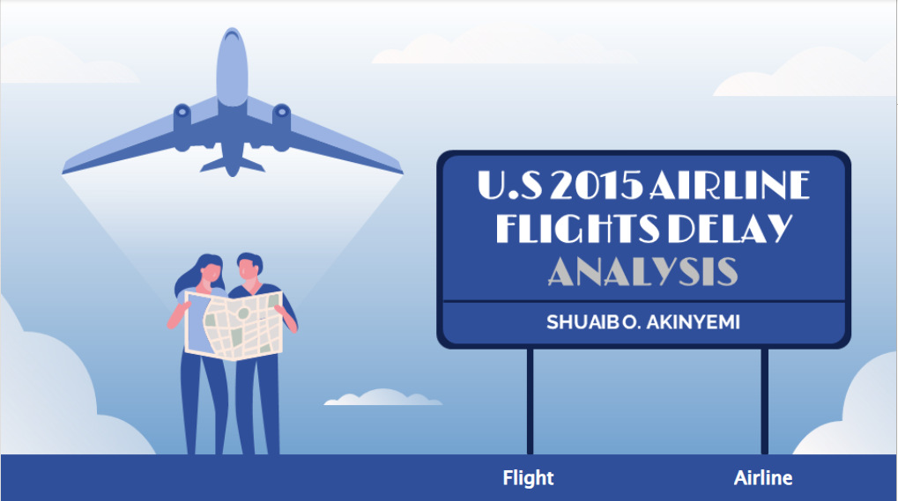
---

## Introduction
This project explores a vast dataset of 5,000,000+ commercial flights in 2015, collected for the **U.S. DOT Air Travel Consumer Report**. Each record captures essential details like airline name, flight number, airports, flight distance, and scheduled/actual departure and arrival times. The dataset discussed in the article can be accessed directly from the **Maven Analytics** website, enabling users to explore and analyze the extensive information on commercial airline flights in 2015.

## Data sources
The analysis will be done on the data source made available Here which Maven Analytics, LLC provided.

## KPIs
This project aims to uncover insights into flight delays and cancellations, highlighting their implications for airlines, passengers, and industry stakeholders. By analyzing the data, valuable information can be derived to address operational challenges, improve customer satisfaction, and inform decision-making by airlines, regulators, and airports by answering the following questions;
1.	How does the overall flight volume vary by month? By day of week?
2.	What percentage of flights experienced a departure delay in 2015? Among those flights, what was the average delay time, in minutes?
3.	How does the % of delayed flights vary throughout the year? What about for flights leaving from Boston (BOS) specifically?
4.	How many flights were canceled in 2015? What % of cancellations were due to weather? What % were due to the Airline/Carrier?
5.	Which airlines seem to be most and least reliable, in terms of on-time departure?

## Data Importation
The datasets were provided in Excel format; hence the extraction was straightforward. In Data Ribbon, simply click on “Excel Workbook”, then Open>Browse and navigate to the location where the dataset is stored, then click Browse and find your dataset.

## Cleaning and Analyzing Procedures
After thoroughly and systematically examining the dataset, no null values, duplicates, or other abnormalities that require resolution were found. The data is clean and ready for analysis, allowing us to proceed without data preprocessing.
In the dataset, a total of 5,819,079 flights were scheduled in 2015. Now, let’s explore the number of flights canceled or delayed and identify the airlines associated with them.
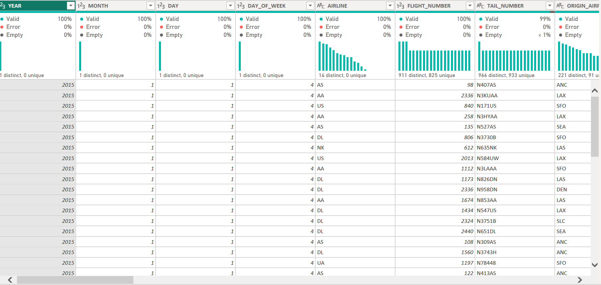
---

## Skills/Concepts Demonstrated
The following power BI were incorporated:
- Project Planning and Documentation,
- Data Gathering,
- Power Query,
- Report Design,
- Data Modelling,
- Data Visualization,
- Data Analysis Expression (DAX),
- Quick Measures,
- Filters,
- Page Navigation,
- Button,
- Business and Analytics Reporting,
- Performance Optimization,
- Deployment and Power BI Service

## Data Modelling
The primary tables that make up the data model are Airline, Airport, and Flight. To optimize the performance of the data model, these tables are interconnected through specific relationships, primarily constructed on unique identifiers in order to enable analysis of airline operations, flight schedules, and airport details.
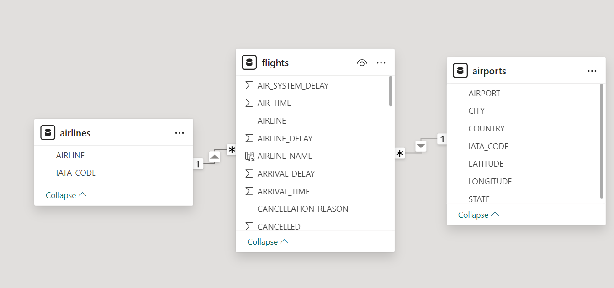
---

## Visualization
The report comprises 2 pages
1.	Flight Analysis
2.	Airline Analysis

## Analysis Summary
### How does the overall flight volume vary by month? By the day of the week?

Monthly Flights     |    Number of Flights by Day of Week
:------------------:|:----------------------:
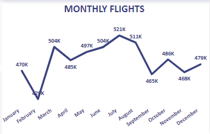 |    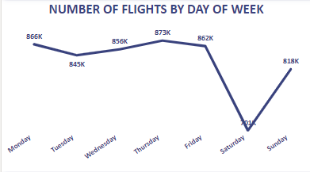

The data shows that flights are highest in July and lowest in February, which corresponds with less days in the non-leap year. Furthermore, a seasonal trend was evident in the fact that more flights were scheduled in the summer than in other months.
Because there are fewer months with thirty-one days, there are about half as many flights scheduled on the 31st than there are on other days. In addition, there are fewer flights on weekends, especially Saturdays, and near the end of the month, which may be related to February's shortened duration.
---

### What percentage of flights experienced a departure delay in 2015? Among those flights, what was the average delay time, in minutes?
Delayed Departure (%)                |        Average Delay Time (Minutes)
:-----------------------------------:|:------------------------------------:
                |      

From the analysis, it is evident that in 2015, a total of 2,125,618 flights which was proportionate to 37% of the total departure experienced departure delays. The average delay time for these flights was 32.7 minutes.
Furthermore, when examining the average departure delay for flights by airline, Spirit Airlines stands out with the highest average delay time of 16 minutes, followed by United Air Lines Inc. at 14.4 minutes. In contrast, Hawaiian Airlines demonstrates the lowest average departure delay of only 0.5 minutes

### How does the % of delayed flights vary throughout the year? What about for flights leaving from Boston (BOS) specifically?

Monthly Percentage of Delayed Flight                |        Delayed Boston Flight
:--------------------------------------------------:|:------------------------------------:
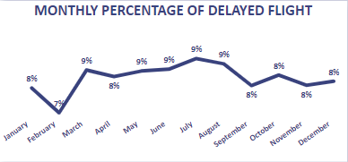                      |      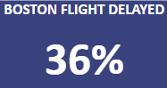

The data shows that flights are highest in July and lowest in February, which corresponds with less days in the non-leap year. Furthermore, a seasonal trend was evident in the fact that more flights were scheduled in the summer than in other months. Because there are fewer months with thirty-one days, there are about half as many flights scheduled on the 31st than there are on other days.
Boston had 36 percent of their flights delayed.

### How many flights were canceled in 2015? What % of cancellations were due to weather? What % were due to the Airline/Carrier?
Cancelled Flight               |        Cancellation of Flight (%)
:-----------------------------:|:--------------------------------------------------:
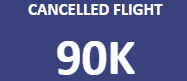      |              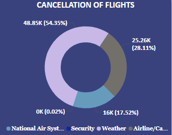

A total number of 89,884 flights were canceled.
Also, we can see that weather stands to be the top reason for flight cancellations followed by Airline/Carrier issues.

## Which airlines seem to be most and least reliable, in terms of on-time departure?
Top 7 Reliable          |        Least 7 Relaible
:----------------------:|:-----------------------:
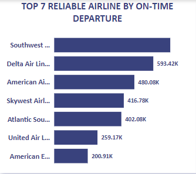           | 

In terms of On-time departure, Southwest Airlines Co. seems to be the most reliable commercial airline with 18.8 percent of the total on-time departure. In comparison, Virgin America happens to be the least reliable with 1.04 percent of the total on-time departure.

### Insight
1.	There is a seasonal trend in flights, with the biggest volume occurring in July and the lowest in February, possibly due to February's shorter month.
2.	Fewer months have thirty-one days, so fewer flights are booked on the 31st. Additionally, there are fewer flights on Saturdays and toward the end of the month.
3.	American Eagle Airlines had the greatest cancellation rate (5.1%) and Southwest Airlines had the largest number of flight cancellations (16,043).
4.	Hawaiian Airlines Inc. likewise got the lowest percentage (0.22%) of flight cancellations. 
Problems.
5.	Of all airlines, American Eagle Airlines has the highest cancellation rate (0.84%), implying that it is an unreliable airline when it comes to flight cancellations. In contrast, Southwest Airlines has the highest number of cancellations because of airline problems.
6.	The number of airline delays in 2015 was highest with Southwest Airlines, accounting for 415,513 flights with an average delay duration of 9.4 minutes. However, Spirit Airlines's 14.74% delay rate is the greatest because of airline problems. implying that Spirit Airlines' flight delays are an inconsistent source of information.
7.	Other airports rank well in all categories, with O'Hare International Airport (ORD) in Chicago having the most cancellations and delays of any airport.

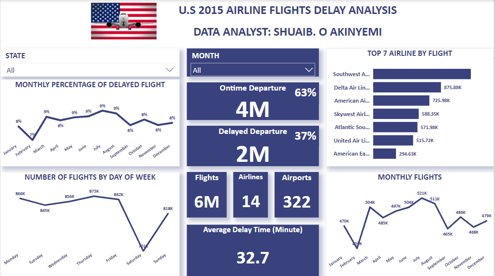
---

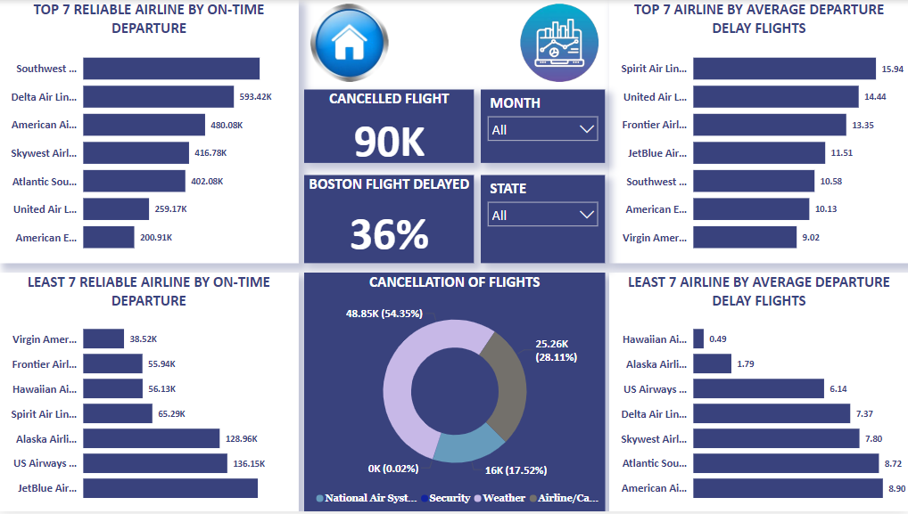

### Recommendation
Travelers are advised to consider flexible itinerary options, monitor flight status updates, and investigate travel insurance options for financial protection to lessen the impact of delays.
